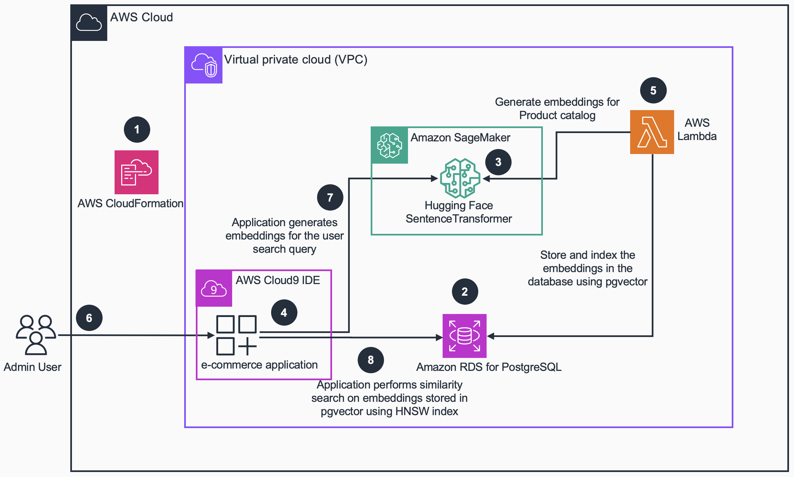
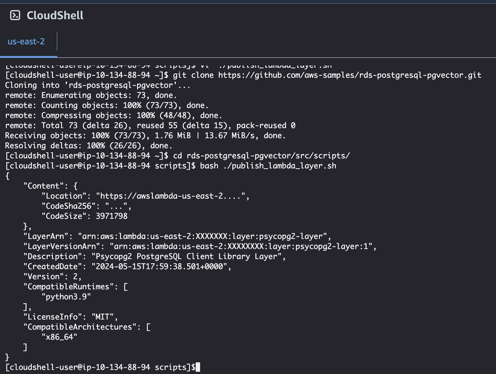
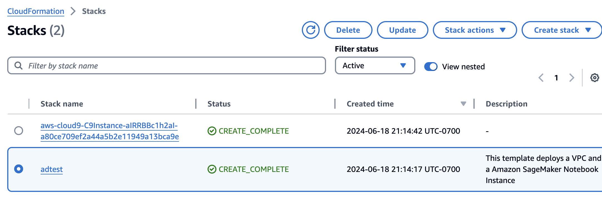
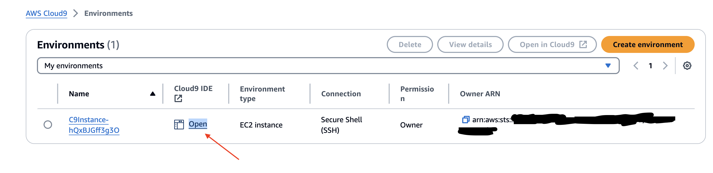
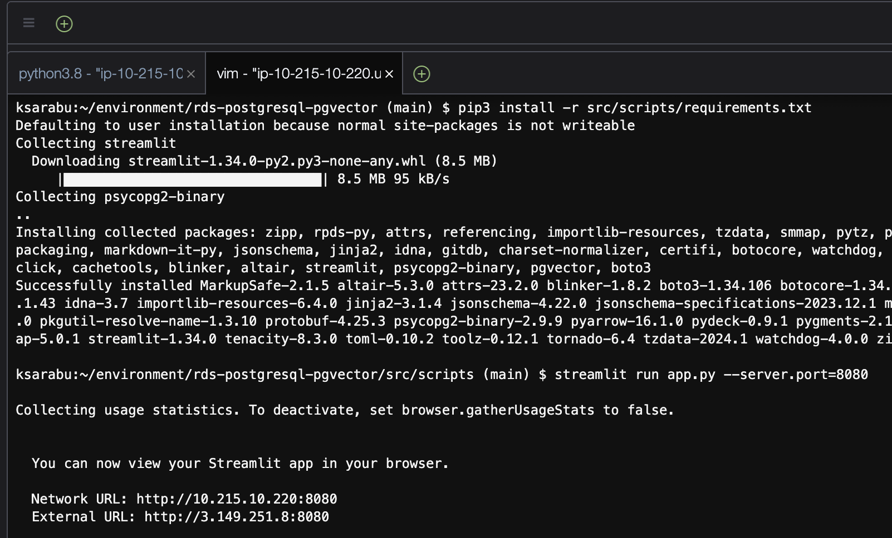
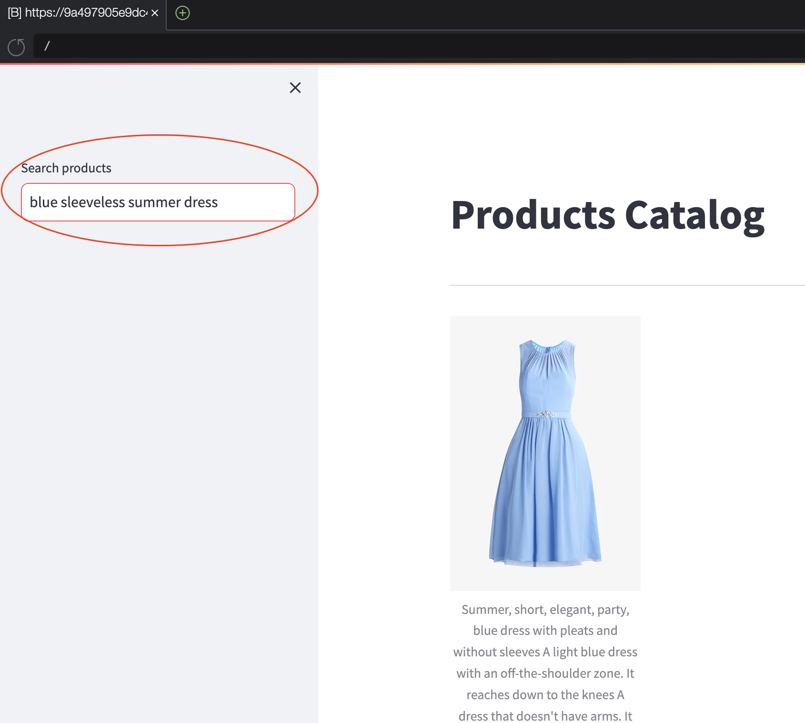
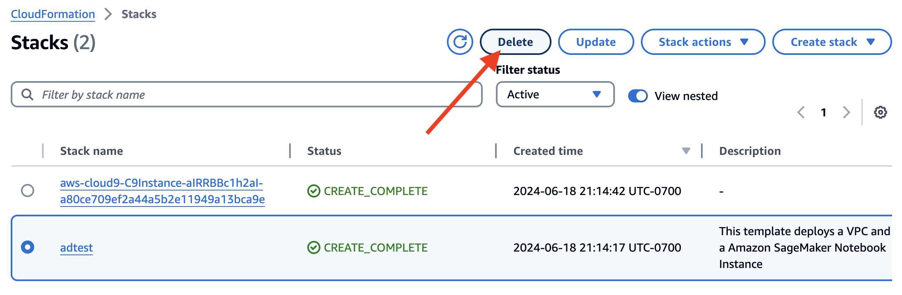
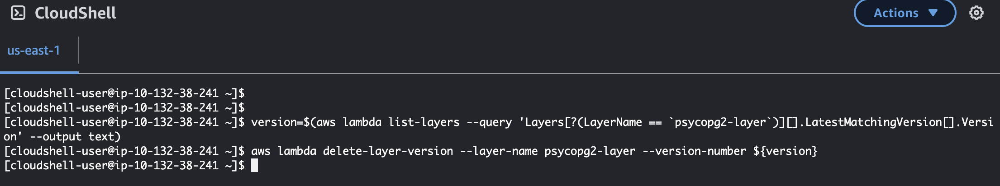

# Guidance for E-commerce Products Similarity Search on AWS

This repository guides users through creating a product similarity search using Amazon SageMaker and Amazon RDS for PostgreSQL using the open source extension `pgvector`.

## Table of Content

List the top-level sections of the README template, along with a hyperlink to the specific section.

### Required

1. [Overview](#overview)
    - [Architecture](#Architecture)
    - [Cost](#cost)
2. [Prerequisites](#prerequisites)
    - [Operating system](#Operating-system)
3. [Deployment Steps](#deployment-steps)
4. [Deployment Validation](#deployment-validation)
5. [Running the Guidance](#running-the-guidance)
6. [Next Steps](#next-steps)
7. [Cleanup](#cleanup)

## Overview

This guidance helps you build a product catalog similarity search solution for e-commerce using Amazon SageMaker and Amazon RDS for PostgreSQL with the pgvector extension. `pgvector` is an open-source extension designed to augment PostgreSQL databases with the capability to store and conduct searches on ML-generated embeddings to identify both exact and approximate nearest neighbors. It’s designed to work seamlessly with other PostgreSQL features, including indexing and querying. To generate vector embeddings, you can use ML service such as [Amazon SageMaker](https://aws.amazon.com/sagemaker/) or [Amazon Bedrock](https://aws.amazon.com/bedrock/). Please see AWS [Decision Guide](https://aws.amazon.com/getting-started/decision-guides/machine-learning-on-aws-how-to-choose/) to pick the right AI and ML services, frameworks, and foundation models to support your work on AWS. The solution involves generating vector embeddings for product descriptions using a pre-trained Hugging Face model deployed on SageMaker. These embeddings are then stored in an RDS for PostgreSQL database with the pgvector extension, enabling efficient similarity searches. By leveraging pgvector's indexing capabilities, we optimize search performance, providing accurate and fast product recommendations. This versatile approach can be applied across various industries, including retail, gaming, and life sciences, to enhance search functionality and user engagement through AI-powered solutions.

### Architecture



### Cost

You will need to pay for the AWS services used while running this guidance.

For cost management, we recommend creating a budget through AWS Cost Explorer. Prices are subject to change. For more details, refer to the pricing pages for each AWS service used in this guidance.

### Total monthly estimated cost for all services

The following table provides a sample cost breakdown for deploying this Guidance with the default parameters in the `us-east-2` Region for one month:


| AWS service  | Dimensions | Cost [USD] |
| ----------- | ------------ | ------------ |
| Amazon RDS for PostgreSQL | 1 `db.t3.micro` Instances, 10GiB gp3 Storage | $ 15.44 USD per month |
| Amazon SageMaker | 1 `ml.m5.large` instance for SageMaker real-time inference | $ 82.80 USD per month |
| Amazon EC2 | 1 t3.medium instance | $ 30.37 per month |
| AWS CloudWatch Logs | 1GB/month of log data generated | $ 1.53 per month |
| AWS Lambda | 1 million requests in each Region | $ 0.40 per month |
| | | |
|Total Estimated Cost | | $ 130.54 per month |
| | | |

Note: We recommend creating a [Budget](https://docs.aws.amazon.com/cost-management/latest/userguide/budgets-managing-costs.html) through [AWS Cost Explorer](https://aws.amazon.com/aws-cost-management/aws-cost-explorer/) to help manage costs. Prices are subject to change. For full details, refer to the pricing webpage for each AWS service used in this Guidance.

## Prerequisites

To follow along with this tutorial, you should have the following prerequisites:

- An [AWS account](https://aws.amazon.com/account/)
- Permission to create AWS resources (e.g., IAM Roles, IAM policies, Amazon EC2 instances, AWS Cloud9, Amazon RDS for PostgreSQL, and Amazon SageMaker)

### Operating system

Since the guidance runs in the AWS cloud, you should run it through Mac or Windows instances.

## Deployment Steps

1. Sign in to the AWS Management Console with your IAM user name and password.
2. Open AWS Cloudshell in target Region, and clone the git repository and publish Psycopg2 Lambda layer.
    
    ```
    git clone https://github.com/aws-solutions-library-samples/guidance-for-e-commerce-products-similarity-search-on-aws.git
    cd guidance-for-e-commerce-products-similarity-search-on-aws/src/scripts/
    bash ./publish_lambda_layer.sh
    ```
    The output would look like below:
    
    

3. From AWS Console, go to CloudFormation Service and choose Launch Stack using [CloudFormation Template](src/cfn/sagemaker-rdspg.yaml). Provide required CloudFormation parameters.
4. On the Create stack page, select the check box to acknowledge the creation of IAM resources.
5. Choose Create stack.
6. Wait for the stack creation to complete. You can examine various events from the stack creation process on the Events tab. When the stack creation is complete, you see the status `CREATE_COMPLETE`.

## Deployment Validation

1. Verify that the CloudFormation stacks has been successfully deployed.

    

## Running the Guidance

1. From AWS Console, open the Cloud9 IDE.
    
2. In Cloud9 IDE shell, run the following commands to start the application
    ```
    cd guidance-for-e-commerce-products-similarity-search-on-aws
    pip3 install -r src/scripts/requirements.txt
    streamlit run app.py --server.port=8080
    ```
    The output would look like below:
    
3. In Cloud9 IDE, open preview of running application.
    
4. Test the application search product catalog using the preview brower.
    

## Next Steps

For more information, refer to the following:

[Building AI-powered search in PostgreSQL using Amazon SageMaker and pgvector](https://aws.amazon.com/blogs/database/building-ai-powered-search-in-postgresql-using-amazon-sagemaker-and-pgvector/)

## Cleanup

1. Delete the CloduFormation template using AWS Console to cleanup the resources.
    
2. Open AWS Cloudshell in target Region, and run the following command(s) to delete the Lambda layer.

    ```
    version=$(aws lambda list-layers --query 'Layers[?(LayerName == `psycopg2-layer`)][].LatestMatchingVersion[].Version' --output text)
    aws lambda delete-layer-version --layer-name psycopg2-layer --version-number ${version}
    ```

    The output would look like below:

    

## Security

See [CONTRIBUTING](CONTRIBUTING.md#security-issue-notifications) for more information.

## License

This library is licensed under the MIT-0 License. See the LICENSE file.


[def]: static/cfn_output1.png