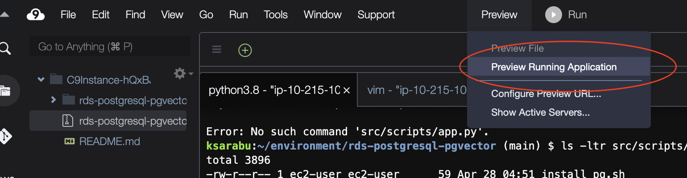

# Guidance for E-commerce Products Similarity Search on AWS

This repository guides users through creating a product similarity search using Amazon SageMaker and Amazon RDS for PostgreSQL using the open source extension `pgvector`.

# How does it work?

we have used pre-trained model [`all-MiniLM-L6-v2`](https://huggingface.co/sentence-transformers/all-MiniLM-L6-v2) from Hugging Face SentenceTransformers to generate fixed 384 length sentence embedding from feidegger, a zalandoresearch dataset. Then those feature vectors are stored in [RDS for PostgreSQL](https://aws.amazon.com/rds/postgresql/) using extension `pgvector` for product similarity search.

# What is `pgvector`?

pgvector is an open-source extension designed to augment PostgreSQL databases with the capability to store and conduct searches on ML-generated embeddings to identify both exact and approximate nearest neighbors. It’s designed to work seamlessly with other PostgreSQL features, including indexing and querying. 

To generate vector embeddings, you can use ML service such as [Amazon SageMaker](https://aws.amazon.com/sagemaker/) or [Amazon Bedrock](https://aws.amazon.com/bedrock/). Please see AWS [Decision Guide](https://aws.amazon.com/getting-started/decision-guides/machine-learning-on-aws-how-to-choose/) to pick the right AI and ML services, frameworks, and foundation models to support your work on AWS.

By utilizing the pgvector extension, PostgreSQL can effectively perform similarity searches on extensive vector embeddings, providing businesses with a speedy and proficient solution. 

Please review pgvector [documentation](https://github.com/pgvector/pgvector) for additional details.

# Solution


## Prerequisites

To follow along with this tutorial, you should have the following prerequisites:

- An [AWS account](https://aws.amazon.com/account/)
- Permission to create AWS resources (e.g., IAM Roles, IAM policies, Amazon EC2 instances, AWS Cloud9, Amazon Aurora DB clusters, and Amazon EKS clusters)

## Deploy the solution

1. Sign in to the AWS Management Console with your IAM user name and password.
2. Open AWS Cloudshell in target Region, and clone the git repository and publish Psycopg2 Lambda layer.
    
    ```
    git clone https://github.com/aws-samples/rds-postgresql-pgvector.git
    cd rds-postgresql-pgvector/src/scripts/
    bash ./publish_lambda_layer.sh
    ```
    The output would look like below:
    
    

3. From AWS Console, go to CloudFormation Service and choose Launch Stack using [CloudFormation Template](src/cfn/sagemaker-rdspg.yaml)
4. On the Create stack page, select the check box to acknowledge the creation of IAM resources.
5. Choose Create stack.
6. Wait for the stack creation to complete. You can examine various events from the stack creation process on the Events tab. When the stack creation is complete, you see the status `CREATE_COMPLETE`.
7. From AWS Console, open the Cloud9 IDE.
    
8. In Cloud9 IDE shell, run the following commands to start the application
    ```
    cd rds-postgresql-pgvector
    pip3 install -r src/scripts/requirements.txt
    streamlit run app.py --server.port=8080
    ```
    The output would look like below:
    
9. In Cloud9 IDE, open preview of running application.
    
10. Test the application search product catalog using the preview brower.
    

## Cleanup

1. Delete the CloduFormation template using AWS Console to cleanup the resources.

## Security

See [CONTRIBUTING](CONTRIBUTING.md#security-issue-notifications) for more information.

## License

This library is licensed under the MIT-0 License. See the LICENSE file.
